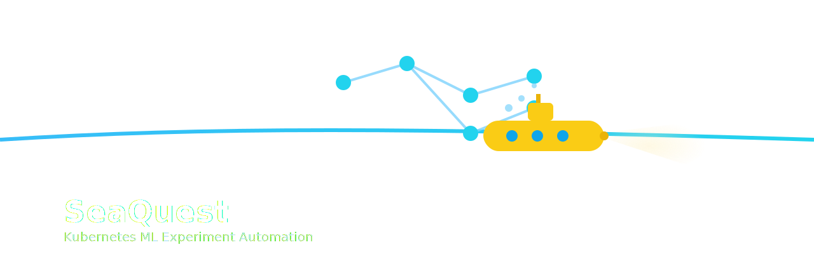

<p align="center">
  
</p>

# seaQuest

seaQuest is a python package that automates the process of executing machine learning experiments on a kubernetes cluster.

## Usage

Install the module and it's dependencies via PyPI.
```
python -m pip install seaquest
```

Or install from source:
```
git clone https://github.com/IancuOnescu/seaQuest.git
cd seaquest
pip install -e .
```

Requirements
- Python 3.9+
- Access to a Kubernetes cluster
- `kubectl` configured

### Running the experiments:

1. Define a model that inherits the _NautPipelineModel_ class. This means that the model needs to define two functions: _train_ and _infer_. The one not used for the experiments can be left empty. Make sure that all file saving is done using the _OutputContext_ context switch.
2. Create a configuration file with all the required parameters. For more information on this please refer to the [official documentation](https://seaquest.readthedocs.io/en/latest/)
3. Call the experiment module
```
python -m seaquest.experiment -cf config_file.yaml --other_params
```
### Pulling the outputs:

After the job launching is done you can pull the output of the experiments by calling the _monitor_ module

```
python -m seaquest.monitor -cf config_file.yaml -od path/to/output_dir --other_params 
```

## Workflow

seaQuest takes as input a number of command line arguments as well as a configuration file. These specify the details that control the creation of kubernetes resources. With these arguments in mind the seaQuest pipeline follows the next steps:
 
1. Validate the provided arguments 
2. Upload the specified model and data files to the k8s cluster.
2.0. Generate an additional config used for the cluster side runner.
2.1. Create a Persistent Volume Claim (PVC) with the specified name. (skip creation if it already exists)
2.2. Launch a Pod.
3.2. Copy the files to the PVC through the created Pod
3.3. Delete the launched Pod
3. Launch jobs that execute the specified model function (_train_ or _infer_)

When calling the monitor module of the package the pipeline follows the next steps:

1. Validate the provided arguments
2. Start monitoring the status of the provided jobs
3. If a job reaches the Finished status attempt to pull the output files
3.1. Launch a Pod.
3.2. Copy the files from the output directory to the user's local machine
3.3. Delete the Pod
4. Delete the jobs that have reached the Finished status and wait for the others.

The monitor module looks for the output files in a directory on the PVC mount created by the job. This means that the model *must* use the OutputContext context switch in order to ensure that all of the files are correctly pulled.  

## Targeted ML Frameworks

The [Docker Image](https://hub.docker.com/repository/docker/iancuonescu/seaquest) used currently provides a PyTorch + Huggingface environment. A user can specify additional depdencies through a _requirements.txt_ file, placed in the root of the directory where the model used for experiments is located.

## Logging

The package uses extensive logging both on and off the server. Logging is not overwritten, but appended.